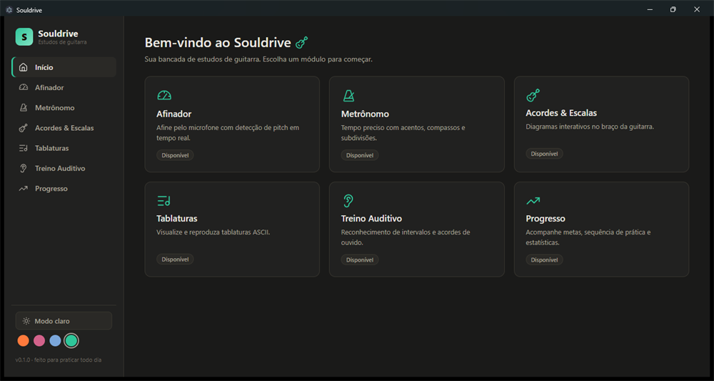
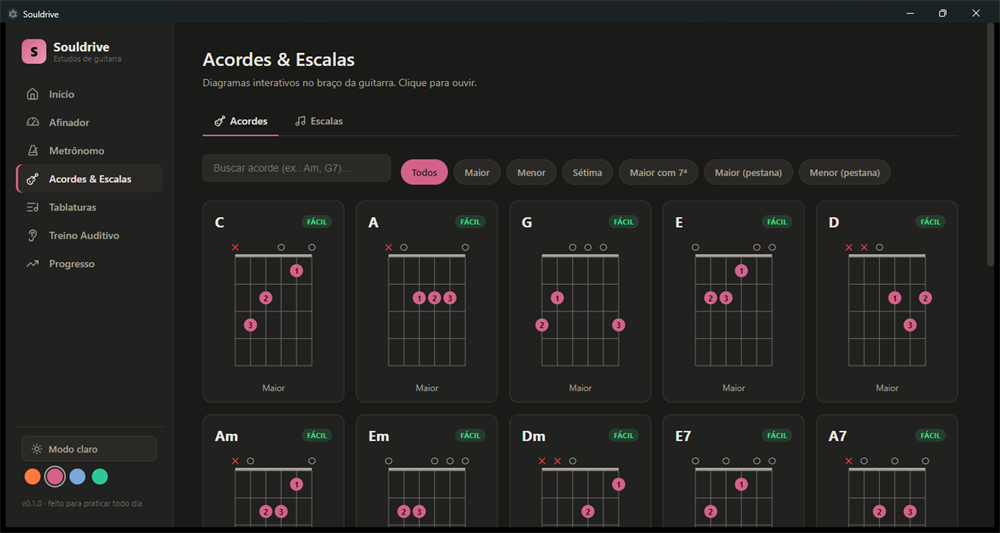
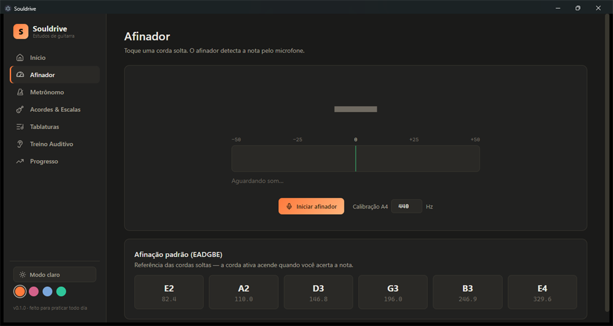
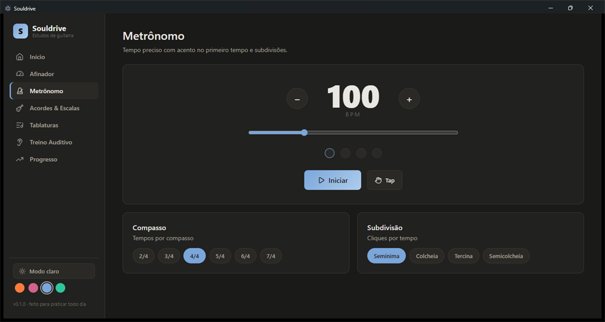
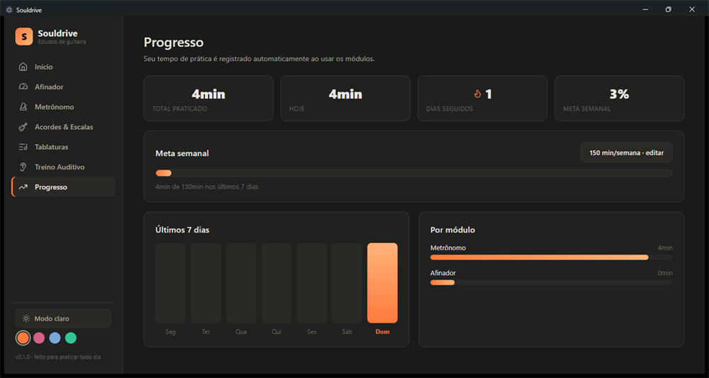

# Souldrive

Bancada de estudos de guitarra para Windows — afinador, metrônomo, acordes & escalas, tablaturas, treino auditivo e acompanhamento de progresso.

## Download

➡️ **[Baixar Souldrive-0.1.0-setup.exe](https://github.com/edvanomendes-max/SoulDrive-app/releases/download/v0.1.0/Souldrive-0.1.0-setup.exe)**

Ou veja todas as versões na página de **[Releases](https://github.com/edvanomendes-max/SoulDrive-app/releases)**.

## Capturas de tela

<table>
  <tr>
    <td width="50%"> <b>Início</b> · destaque verde menta</td>
    <td width="50%"> <b>Acordes &amp; Escalas</b> · destaque magenta</td>
  </tr>
  <tr>
    <td width="50%"> <b>Afinador</b> · destaque laranja</td>
    <td width="50%"> <b>Metrônomo</b> · destaque azul</td>
  </tr>
  <tr>
    <td width="50%"> <b>Progresso</b> · destaque laranja</td>
    <td width="50%"></td>
  </tr>
</table>

> O tema (claro/escuro) e as 4 cores de destaque — laranja, magenta vintage, azul calcinha e verde menta — são selecionáveis dentro do app.

## Recursos

- **Afinador** — detecção de pitch em tempo real pelo microfone
- **Metrônomo** — tempo preciso com acentos, compassos e subdivisões
- **Acordes & Escalas** — diagramas interativos no braço da guitarra, com áudio
- **Tablaturas** — visualização e reprodução de tablaturas ASCII
- **Treino Auditivo** — reconhecimento de intervalos e acordes, com pontuação
- **Progresso** — metas semanais, sequência de prática e estatísticas

Tema **dark grafite** e **light estilo Apple**, com 4 cores de destaque selecionáveis e ícones modernos.

## Instalação (Windows)

1. Baixe o `Souldrive-0.1.0-setup.exe`.
2. Execute o assistente de instalação.
3. O aplicativo ainda **não é assinado digitalmente** — o Windows SmartScreen pode exibir um aviso. Clique em **"Mais informações" → "Executar assim mesmo"**.

---

© 2026 Souldrive
